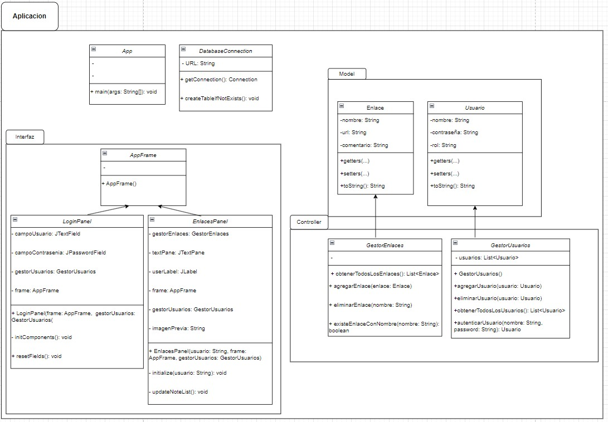
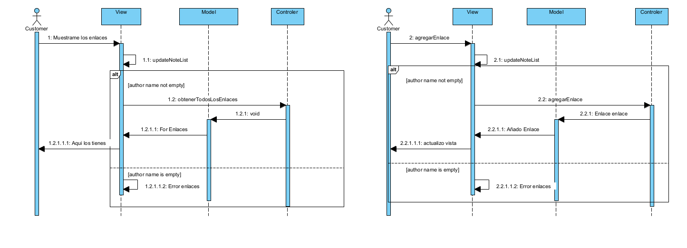

Proyecto Programación
Adrián Abeijón Carbajo

### **● Descripción general del proyecto**

La idea es la siguiente: realizar un programa sencillo, un pequeño programa que permite acceder con un usuario y contraseña y nos permita gestionar diversos enlace. El programa servira como aplicacion para guardar enlaces de apuntes en drive, github, en el danielcastelao y lo que necesitemos.

### **● Objetivos y funcionalidades clave.**

**Objetivos:**
La aplicación constará de un gestor de usuario y una interfaz que use javax.swing para añadir, eliminar y listar elementos que contendran direcciones URL y quiza una breve descripción. Los enlaces serán guardados en una base de datos que será contenida por el propio proyecto.

**Funcionalidades:**

- Permitir o denegar el acceso a los usuarios a determinadas caracteristicas del programa.

- Permitir al usuario guardar elementos con un nombre y una descripción, permitiendole acceder a las direcciones URL almacenadas con un clic. Y que se conserven entre sesiones con una base de datos.

- Permitir al usuario borrar elementos guardados.

- Visualizar y acceder a la lista de elementos guardados en nuestra base de datos.
  

### **● Diagrama de clases inicial.**
[Enlace para mejor visualizacion/actualizacion](https://app.diagrams.net/?mode=google#G1Q7sd5sp3ff6zGosiuDxdSEier1KPHj7V#%7B%22pageId%22%3A%22C5RBs43oDa-KdzZeNtuy%22%7D/ "Enlace diagrama de clases").

### ** Diagrama de secuencia. **

`
### **● Tecnologías y librerías a utilizar.** 

- Java Swing.
- AWT.
- Java Standard Library.
- Java Desktop API (java.awt.Desktop y java.net.URI).
- Manejo de excepciones para control de errores.
- Base de datos SQL Lite

### **● Planificación preliminar del trabajo.** 

Se hará lo que buenamente se pueda cada semana con los escasisimos conocimientos actuales y el tiempo disponible para la asignatura.
Asimismo, se actualizará la aplicación con nuevas funcionalidades y mejoras según los conocimientos que se obtengan durante las clases o la búsqueda de información online.

